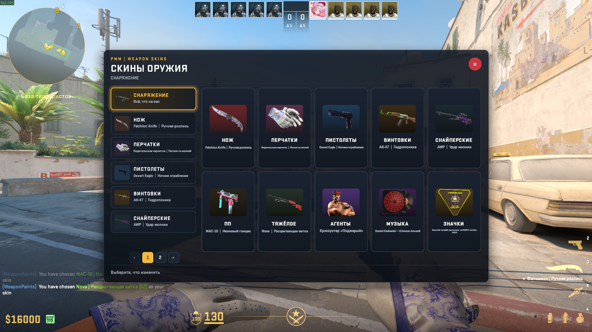

# PMM_WeaponPaints

<h2><a href="https://genesis-cs.space/menuconstructor/index.html">>>>Более подробная информация на сайте<<<</a></h2>



Panorama locker by **Rimmer** for [WeaponPaints](https://github.com/Nereziel/cs2-WeaponPaints). It draws the WeaponPaints menus as a card grid on mouse panorama. A click still runs the original WeaponPaints option.

**Beta.** Bugs are possible. The panorama design is inspired by [EliteGames.Ro](https://elitegames.ro).

Current version: **[0.1.0](https://github.com/RRimmer/PMM-WeaponPaints/releases/tag/PMM_WeaponPaints-0.1.0)**. Needs [MenuManager 1.2.03](https://github.com/RRimmer/PanoramaMenuManagerCS2/releases/tag/MenuManagerCS2-1.2.03) (1.2.02 still works) and CounterStrikeSharp 1.0.376.

**0.1.0.** Config `"Language": "ru"` or `"en"`. Equipped items use the team color, and each card has T/CT dots. Rarity frames come from `pmm_items.json`. Agents, music kits and coins have their own art. Gloves open by type. The grid is 5 cards wide, the window is 65% by 70%. Phantom pictures from the first test are fixed. Default gloves, agents, music and coins have pictures.

You can read more on the site: https://genesis-cs.space/menuconstructor/index.html

## Site

- [Constructor](https://genesis-cs.space/menuconstructor/index.html) — the PMM menu look.
- [CSCreatePanorama](https://genesis-cs.space/menuconstructor/menumanager/create/index.html) — restyle this locker and export `wp.xml`, CSS and `wp_triggers.json`. CSCreatePanorama is beta.
- [Download](https://genesis-cs.space/menuconstructor/menumanager/download/index.html) — MenuManager and this locker.
- [Wiki](https://genesis-cs.space/menuconstructor/menumanager/wiki/index.html) — how to check a panorama in Workshop Tools without waiting for the Workshop.
- [API](https://genesis-cs.space/menuconstructor/menumanager/api/index.html) — `GetSelectedMenu` and `pmm:paint`.

## Repository layout

| Folder | What it is |
| --- | --- |
| `PMM_WeaponPaints` | The plugin: `Plugin.cs`, `WpDatabase.cs`, `ItemData.cs`, `Lang.cs`, `icons.json`, `pmm_items.json`, `panorama/` |
| `MenuManagerApi` | Compile-time library. Do not copy `MenuManagerApi.dll` next to this plugin |

The player-ready archive is [PMM_WeaponPaints-0.1.0](https://github.com/RRimmer/PMM-WeaponPaints/releases/tag/PMM_WeaponPaints-0.1.0).

## Install from a Release

MenuManager 1.2.03 must already be on the server (1.2.02 still works). This archive does not include it. Keep `pmm_items.json` next to the DLL. `"Language"` in the config is `ru` or `en`. An old config is not updated by itself: add the field by hand. The database user needs INSERT/UPDATE on `wp_player_agents`. `!pws` opens only on T or CT, and only for mouse panorama.

Copy `Server-plugins/counterstrikesharp` into `game/csgo/addons/`. You get `addons/counterstrikesharp/plugins/PMM_WeaponPaints/`. Keep `MySqlConnector.dll` next to `PMM_WeaponPaints.dll`. Delete `MenuManagerApi.dll` from `plugins/WeaponPaints` and from this plugin folder. One copy stays in `shared/MenuManagerApi/` from MenuManager. Delete `plugins/PPW_WeaponPaints` if it is still there. Restart the server. `css_plugins reload` does not unload the old assembly.

Copy `Content-addonmanager/panorama` into the MultiAddonManager addon and rebuild it in Workshop Tools:

- `panorama/layout/custom_game/wp.xml`
- `panorama/styles/custom_game/wp.css`

`!pws` opens the locker only when `!menu` is mouse panorama: Select menu, then Panorama (mouse). In WeaponPaints set `MenuType` to `selectable`.

The config appears after the first start: `configs/plugins/PMM_WeaponPaints/PMM_WeaponPaints.json`. `Commands` defaults to `["pws"]`. `OpenDelay` and `InputDelay` default to `0.2`. `DatabaseHost`, `DatabasePort`, `DatabaseUser`, `DatabasePassword` and `DatabaseName` are the **WeaponPaints** database, not MenuManager. This plugin only reads it. Without that database the locker stays closed and `!pws` says so in chat.

If the buttons come from CSCreatePanorama, put `wp_triggers.json` next to the DLL.

## Build

You need the .NET 10 SDK.

```bash
dotnet build PMM_WeaponPaints.sln --configuration Release
```

Output: `PMM_WeaponPaints/bin/Release/net10.0/`. Ship `PMM_WeaponPaints.dll`, `icons.json`, `pmm_items.json`, `MySqlConnector.dll` and the `panorama` folder. Do not ship `CounterStrikeSharp.API.dll` or `MenuManagerApi.dll`.

## License

[GNU GPL v3](LICENSE).

---

# PMM_WeaponPaints

Панорамный локер от **Rimmer** для [WeaponPaints](https://github.com/Nereziel/cs2-WeaponPaints). Меню WeaponPaints рисуются сеткой карточек на панораме мышью. Клик по-прежнему вызывает исходный пункт WeaponPaints.

**Beta.** Возможны баги. Дизайн панорамы вдохновлён [EliteGames.Ro](https://elitegames.ro).

Текущая версия: **[0.1.0](https://github.com/RRimmer/PMM-WeaponPaints/releases/tag/PMM_WeaponPaints-0.1.0)**. Нужен [MenuManager 1.2.03](https://github.com/RRimmer/PanoramaMenuManagerCS2/releases/tag/MenuManagerCS2-1.2.03) (1.2.02 тоже подходит) и CounterStrikeSharp 1.0.376.

**0.1.0.** В конфиге `"Language": "ru"` или `"en"`. Экипированное красится в цвет команды, на карточке кружки T/CT. Рамки редкости берутся из `pmm_items.json`. У агентов, музыки и значков свои картинки. Перчатки открываются по типу. Сетка — 5 карточек в ряд, окно 65% на 70%. Фантомные картинки с первого теста исправлены. У стандарта перчаток, агентов, музыки и значков есть картинки.

Вы можете ознакомиться с более подробной информацией на сайте: https://genesis-cs.space/menuconstructor/index.html

## Сайт

- [Конструктор](https://genesis-cs.space/menuconstructor/index.html) — вид меню PMM.
- [CSCreatePanorama](https://genesis-cs.space/menuconstructor/menumanager/create/index.html) — перерисовать локер и скачать `wp.xml`, CSS и `wp_triggers.json`. CSCreatePanorama тоже beta.
- [Скачать](https://genesis-cs.space/menuconstructor/menumanager/download/index.html) — MenuManager и этот локер.
- [Wiki](https://genesis-cs.space/menuconstructor/menumanager/wiki/index.html) — как проверить панораму в Workshop Tools, не дожидаясь мастерской.
- [API](https://genesis-cs.space/menuconstructor/menumanager/api/index.html) — `GetSelectedMenu` и `pmm:paint`.

## Что лежит в репозитории

| Папка | Зачем |
| --- | --- |
| `PMM_WeaponPaints` | Плагин: `Plugin.cs`, `WpDatabase.cs`, `ItemData.cs`, `Lang.cs`, `icons.json`, `pmm_items.json`, `panorama/` |
| `MenuManagerApi` | Библиотека только для сборки. `MenuManagerApi.dll` рядом с этим плагином не клади |

Готовый архив: [PMM_WeaponPaints-0.1.0](https://github.com/RRimmer/PMM-WeaponPaints/releases/tag/PMM_WeaponPaints-0.1.0).

## Установка с Release

На сервере уже должен стоять MenuManager 1.2.03 (1.2.02 тоже подходит). В этот архив он не входит. Рядом с DLL оставь `pmm_items.json`. `"Language"` в конфиге — `ru` или `en`. Старый конфиг сам не дополняется: поле нужно дописать. Пользователю базы нужно право INSERT/UPDATE на `wp_player_agents`. `!pws` открывается только за T или CT и только на панораме мышью.

`Server-plugins/counterstrikesharp` копируется в `game/csgo/addons/`. Получится `addons/counterstrikesharp/plugins/PMM_WeaponPaints/`. `MySqlConnector.dll` оставь рядом с `PMM_WeaponPaints.dll`. Удали `MenuManagerApi.dll` из `plugins/WeaponPaints` и из папки этого плагина. Одна копия остаётся в `shared/MenuManagerApi/` от MenuManager. Папку `plugins/PPW_WeaponPaints` удали, если она есть. Потом полностью перезапусти сервер. `css_plugins reload` старую сборку не выгружает.

`Content-addonmanager/panorama` копируется в аддон MultiAddonManager и собирается в Workshop Tools:

- `panorama/layout/custom_game/wp.xml`
- `panorama/styles/custom_game/wp.css`

`!pws` открывает локер только если в `!menu` выбрана панорама мышью: Выбор меню → Панорама (мышь). В WeaponPaints поставь `MenuType: selectable`.

Конфиг появится после первого запуска: `configs/plugins/PMM_WeaponPaints/PMM_WeaponPaints.json`. `Commands` по умолчанию `["pws"]`. `OpenDelay` и `InputDelay` — `0.2`. `DatabaseHost`, `DatabasePort`, `DatabaseUser`, `DatabasePassword` и `DatabaseName` — это база **WeaponPaints**, не MenuManager. Плагин её только читает. Без этой базы локер не открывается, а `!pws` пишет об этом в чат.

Если кнопки собраны в CSCreatePanorama, положи `wp_triggers.json` рядом с DLL.

## Сборка

Нужен .NET 10 SDK.

```bash
dotnet build PMM_WeaponPaints.sln --configuration Release
```

Результат: `PMM_WeaponPaints/bin/Release/net10.0/`. В поставку входят `PMM_WeaponPaints.dll`, `icons.json`, `pmm_items.json`, `MySqlConnector.dll` и папка `panorama`. `CounterStrikeSharp.API.dll` и `MenuManagerApi.dll` не клади.

## Лицензия

[GNU GPL v3](LICENSE).
